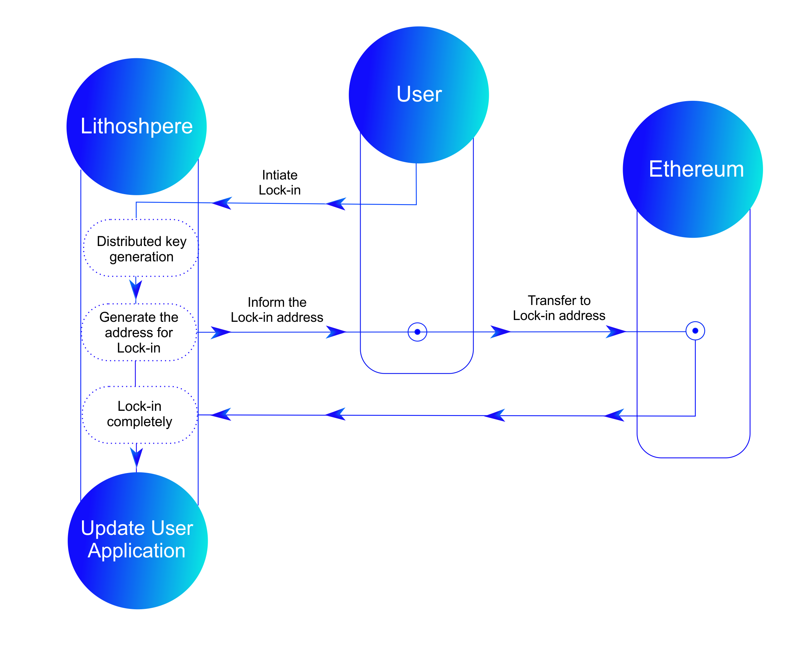

# Cross-Chain Transactions

Asset Lock-in is a process that enables myriad distributed key management and asset mapping for all key-managed tokens.

Asset Lock-out) is the reversal of Lock-in, and it consists of two parts: control rights management and asset mapping disassembly. After Lock-out is completed, control of the digital asset is returned to the owner, restoring complete key storage and centralized key management. By improving the security, liquidity, and DeFi applications of current digital assets, adopting multifarious key distribution management will improve the value of digital assets.
