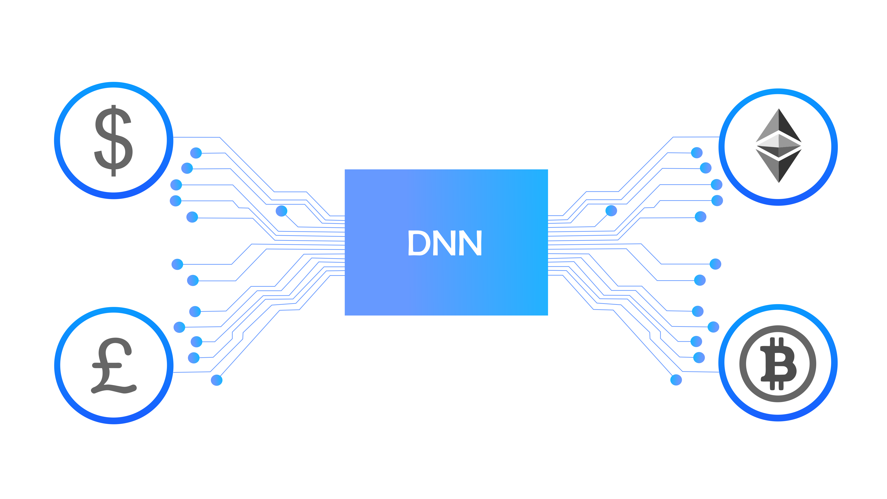

# Deep Neural Networks (DNN)

David Yang PhD, proposes Deep neural networks (DNNs) for Lithosphere smart contracts. DNNs are very useful in blockchain applications such as DeFi and NFT trading. However, training / running large-scale DNNs as part of a smart contract is infeasible on today’s blockchain platforms, due to two fundamental design issues of these platforms. First, blockchains nowadays typically require that each node maintain the complete world state at any time, meaning that the node must execute all transactions in every block. This is prohibitively expensive for computationally intensive smart contracts involving DNNs. Second, existing blockchain platforms expect smart contract transactions to have deterministic, reproducible results and effects. In contrast, DNN is usually trained / run lock-free on massively parallel computing devices such as GPUs, TPUs, and/or computing clusters, which often do not yield deterministic results.

For the first time in smart contracts, Lithosphere implements DNN to make smart contracts intelligent by incorporating large-scale deep neural networks (DNNs) into the code, which has numerous potential applications. For instance, in decentralized finance (DeFi), a DNN might help detect abnormal token price movements, which could be part of a flash-loan attack. A decentralized autonomous organization (DAO) might trade tokens automatically with a DNN trained continually through reinforcement learning. A content creator might apply a generative adversarial network (GAN) to generate visual art images, and subsequently tokenize them as non-fungible tokens (NFTs) tradable in a decentralized exchange.
