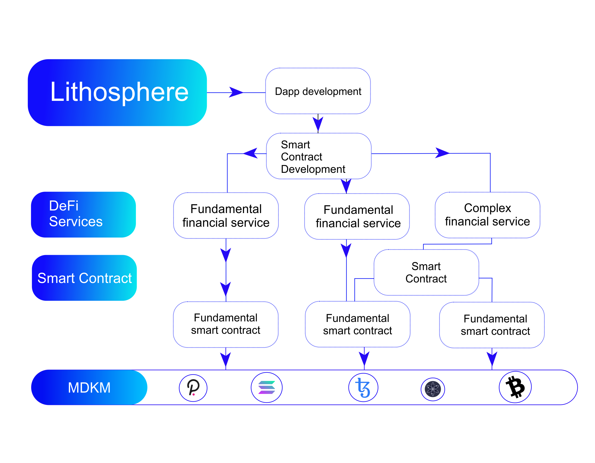

# Design Concept

**Blockchain Emergence and Significance**

Due to a lack of confidence, the conventional market economy has a significant cost. The major method that individuals continuously handle trust is through a centralized organization or company. The fast growth of modern human civilization was aided by people with similar ideals who were organized into institutions such as governments, political parties, and businesses. However, centralized organizations face enormous challenges: First, owing to a lack of trust between organizations and conceptual disputes, various groups become embroiled in violent rivalry, years of warfare, and even nuclear terrorism. Second, resources have been increasingly concentrated in the hands of a small number of people, widening the divide between classes. Finally, there is the concept of a “single point of failure,” such as Solar Winds.

Because a few agencies have monopolized a huge quantity of resources such as power, wealth, skill, and data, the repercussions of them reneging or being hacked will be severe. Lithosphere’s vision is to connect all blockchains and break the barriers between blockchains by allowing them to transact with each other. The end goal is to create a connected network of blockchains, a network of blockchains able to communicate with each other in a decentralized way.

With Lithosphere, blockchains can maintain sovereignty, process transactions quickly and communicate with other blockchains in the ecosystem, making it optimal for a variety of use cases instead of being limited to one blockchain network i.e Solana / Bitcoin / Ethereum / Cardano.

A very good use case of Lithosphere will be the transfer of NFT. Presently, NFT can only be transferred to parties within a given network. At the moment one can’t send Ethereum NFT to a Smart Chain (BSC) user or vice versa. With Lithosphere, users in the eco-system will be able to receive and send tokens from any blockchain that supports Byzantine Fault-Tolerant (BFT) consensus.

The transition from central credit authorization by institutions to inviolable mathematical principles for documenting value exchange is a significant advancement. Currency is, in essence, a consensus. It’s a standard accounting symbol for more convenient value exchange. Reviewing humanity’s financial history, from bartering one thing for another, to using cattle, sheep, or shells as universal equivalents, to the use of precious metals as money, to the current use of paper currency with a strong credit base, the human currency is approaching abstract mathematics, and its nature as symbols or ledgers is more apparent. Human accounting concepts become more aligned with mathematics as a result of blockchains.

It assists the whole accounting system in moving away from a single institution’s control and toward a more fair and transparent path. Financial Inclusion is a concept that aims to provide access to the financial system and low-cost financial services for disadvantaged individuals and small businesses throughout the world. Two and a half billion individuals worldwide are unable to use banks, create savings accounts, or acquire credit cards, thus cutting them off from the global economy. Banks charge exorbitant fees for cross-border transfers. Ordinary investors can only purchase very low- end financial goods from banks and other financial institutions, and they are unable to participate in early-stage investments in technology companies such as Google and Alibaba until they are listed on the stock exchange.

Many small and medium businesses are also having difficulty obtaining loan support from banks, despite having strong credit and excellent performance, because they are not traditional banks’ target clients under the 80/20 rule. The development of blockchain technology is altering the conditions described above. Bitcoin is used to pay workers in other nations, such as El Salvador. Investors who took part in the initial coin offerings (ICO) of well-known blockchain projects like Bitcoin and Ethereum saw returns hundreds of times their initial investments. Inclusionary finance is reaching new heights thanks to blockchain technology. Many organizations are exploring ways to record traditional forms of assets, such as commercial bills and loyalty points, into blockchains, usually in the form of consortium chains. Cryptocurrencies are becoming more acceptable as a form of payment in financial transactions; many organizations are exploring ways to record traditional forms of assets, such as commercial bills and loyalty points, into blockchains, usually in the form of consortium chains. There has been the emergence of digital asset exchanges, which are comparable to traditional financial organizations.

The banking function of exchanging digital assets is performed by these exchanges. They are similar to stock exchanges in that they provide a platform for purchasing and exchanging tokens. The functionalities of a platform for cross-border token transfers are comparable to those of cross- border bank remittances. However, these platforms operate in a centralized way to varying degrees, which not only introduces security issues associated with centralization but also prevents the widespread use of blockchain technology. We need a distributed “bank” based on this phenomenon, where multiple digital currencies and digital assets may be moved in, out, and swapped via blockchains. We require a location where financial products and contracts based on digital currencies and digital assets may be developed and executed, as well as a secure environment to safeguard transaction privacy. Of course, such “banks” will be nothing like traditional banks, except for a few services like debit and credit, remittance, settlement, and financial product sales. Any company or individual with sufficient expertise and cash can open their business windows. They may offer a variety of services while maintaining the security of a distributed blockchain infrastructure, allowing them to deliver more financial services to more people. This is a future financial infrastructure built on digital assets and a distributed financial market, to be more precise.
