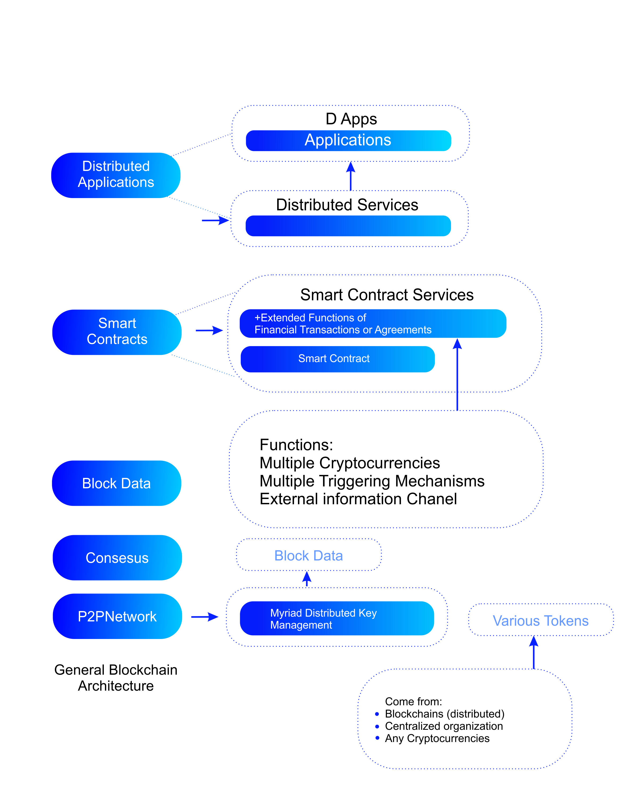

# Design Objectives

The major benefit of blockchain is that it aids in resolving the issue of trust that plagues humanity, making blockchain technology raising human civilization’s level. Its growth is unstoppable because of the human need to reduce transactional expenses. Because each blockchain can perform peer-to-peer value transmission, unlike the original Internet of Information (IoI), blockchain technology moves us from the age of IoI to the age of the Internet of Value (IoV), which may be considered the third generation of the Internet.

Lithosphere has established the following goals based on research on cross-chain technology, AI & Machine Learning, as well as the features of decentralization and its application scenarios, to develop a more widely disseminated blockchain technology and digital asset applications:

#### **Cross-chain Asset Transfer:**

* Connecting large digital currency networks (such as Bitcoin and Ethereum) and completing asset transactions without changing the original chains’ mechanisms. This allows Lithosphere to incorporate freshly created digital currency networks at a very cheap cost.
* Integrate Lithosphere with consortium chains. This handles asset transfers from original chains to Lithosphere, asset transfers from Lithosphere back to original chains, and asset trading on Lithosphere.
* Ensure that cross-chain transactions are secure and that cross-chain transaction services are stable.

#### **Transaction Privacy Protection:**

* Allow trade parties to select whether or not to execute transactions privately.&#x20;
* Provide privacy protection for digital asset transfers and exchanges.
* Provide holders of digital assets with anonymous protection.

#### **Functional Extensibility:**

* Become a decentralized platform for the trading of non-fungible assets and digital currency. Operate a deposit and lending company for several digital currencies.
* Use digital money as a vehicle for digital asset transactions.
* Create brand new digital financial assets and exchange them.

The world has changed dramatically as a result of the Internet of Information. Human civilization is destined to undergo massive societal transformations as a result of the Internet of Value. This is due to the qualities of digitalization, intelligence, decentralization, and inclusiveness that the Internet of Value-based on blockchain technology possesses. Digitization and intelligence, which can help the Internet of Value run more efficiently, are elements that already exist on the Internet of Information, but are now being applied to the Internet of Value.&#x20;

Decentralization is an even more important feature since it will assist to eliminate the bottleneck caused by centralized organizations. People can better safeguard their personal property rights with private keys; they can better resolve conflicts with consensus mechanisms, and they can engage in collaboration in the division of labor with peer-to- peer networks with much lower obstacles. People join the Internet of the Information age when they can easily transfer information over the Internet and program information using algorithms; they will enter the Internet of Value age when they can easily send value over the Internet and program value using smart contracts. The Internet of Value benefits gives it a “high-dimensional” edge over traditional collaboration models.&#x20;

On blockchains, all types of “values” will be expressed and easily exchanged and programmed. As a result, people’s collaboration relationships and human civilization would undoubtedly be drastically altered. The Internet of Value will allow individuals to handle values as if they were informed, and its primary role will be to communicate values. However, to fulfill this purpose, the Internet’s worth must improve in three areas. Interoperability is the first. Values reside on many blockchains, centralization organizations, and data centers, and the Internet of Value necessitates public chains or other solutions that can interact across blockchains, centralization organizations, and data sources, as well as transfer values and perform smart contracts.&#x20;

The second factor is scalability. The Internet of Value must be adaptable to a variety of circumstances, including banking, industry, and government administration. The last point to consider is usefulness. The Internet of Value requires a robust ecosystem and the ability to operate a wide range of apps seamlessly so that developers can create applications quickly and consumers can easily utilize them. However, compared to the Internet of Information, the Internet of Value is still in its early phases, with interoperability, scalability, and usability limitations. In terms of interoperability, although the Internet of Information has been able to transmit and program words, photos, audio, and video as a unified bit of information, the Internet of Value continues to struggle with communicating values between blockchains, much alone off-chain values, and data. Not only does the Internet of Value necessitate cross-chain connectivity, but it also necessitates connection with centralized entities and external data sources.&#x20;

Tokens on separate blockchains can’t trade with each other since existing blockchains can’t communicate with each other (synchronization of state machines). Because blockchains presently cannot communicate with centralized organizations outside of the blockchain, it is difficult to map off-chain assets onto the blockchain. Because existing blockchains can’t read off-chain data, “smart” contracts on them are blind or dumb, unable to see or communicate with the outside world. Taking cross-chain technology as an example, cross-chain communication, much alone building cross-chain smart contracts, is now exceedingly challenging. There are thousands of different types of tokens now available, but each one can only move freely on a single blockchain and has its ecosystem of wallets, smart contract creation tools, and so on.&#x20;

Existing blockchain networks are essentially island ecosystems, and the Internet of Value is still a long way from being genuinely interoperable. In terms of scalability, while the Internet of Information is constantly expanding by encoding various data as bits and programming various scenarios’ communication logic as applications, the Internet of Value is only just getting started by tokenizing various values as tokens and mapping various scenarios’ transaction logic as smart contracts. The Internet of Value scale is severely constrained due to its lack of compatibility. The transfer of off-chain values to the Internet of Value is hampered by the difficulty of mapping actual application scenarios involving various currencies, numerous organizations, and multiple data sources to a blockchain to build a distributed solution. In terms of usability, whereas the Internet of Information’s processing power, storage capacity, and synchronous speed were sufficient to handle most information management needs, the Internet of Value can only accommodate somewhat larger projects. In terms of standardization, platformization, functional modularity, application ecology, interoperability, and anti-quantum assaults, the Internet of Value has a lot of work ahead of it. Interoperability is the most pressing of the three types of obstacles listed above, since it allows us to move assets between blockchains, design smart contracts with various currencies, and improve update scalability. Usability, on the other hand, is a long-term effort, but interoperability and scalability, which have slowed the growth of the Internet of Value, require a quick fix and have become the two most pressing barriers to be addressed.
