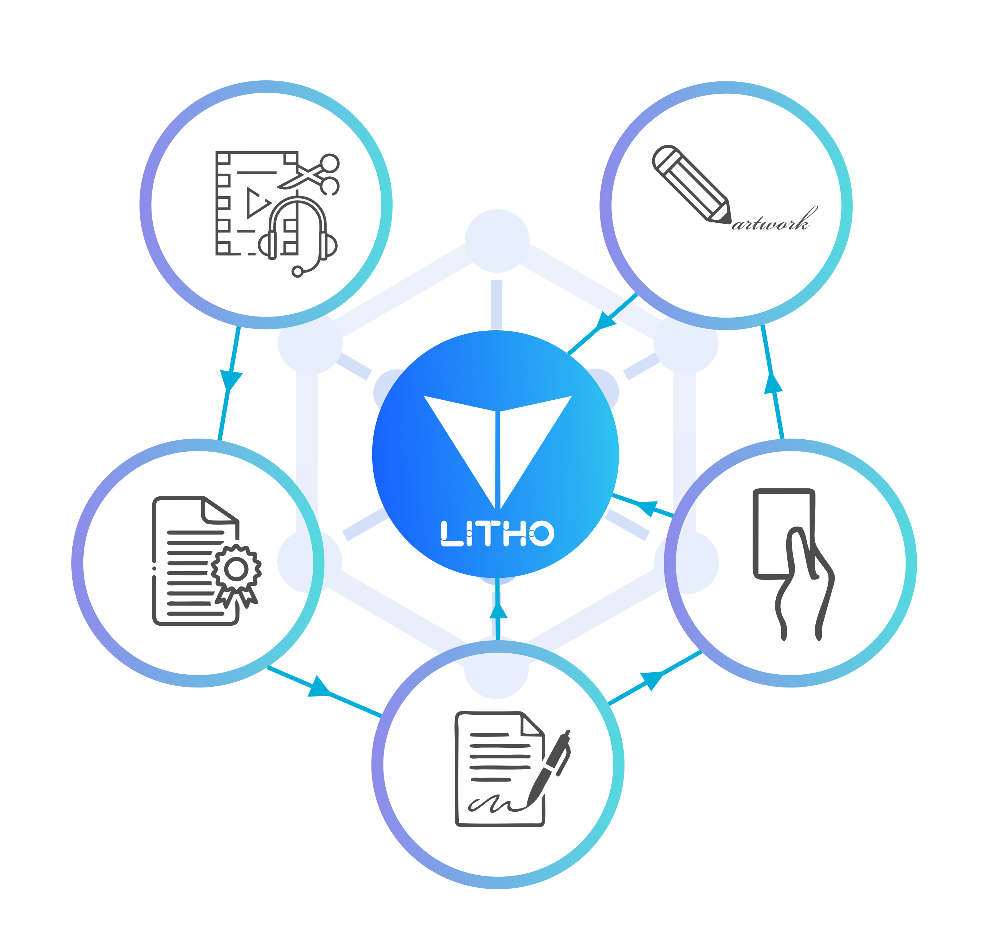
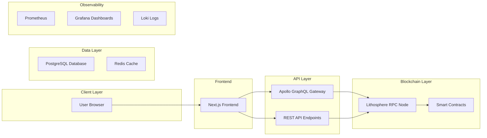

# Architecture Overview

Lithosphere is built on a multi-layered architecture that combines distributed private key management, deep neural networks, and BFT consensus to enable cross-chain interoperability and intelligent smart contracts.

## Distributed Private Key Management and Smart Contract Virtual Machine

Because DeFi assets are displayed as tokens, multi-token smart contracts can substantially improve the interoperability of the Internet of Value and make increasing scalability much easier. Current cross-chain technology primarily uses side-chain technology with two-way pegs and multiple signatures, which can only produce atomic transfers.

Lithosphere takes a different approach: tokens' private keys on various blockchains are securely controlled in a distributed fashion by the public chain. This creates a "freeway" on the Internet of Value, enabling value transfers between various tokens and multi-token smart contracts to provide DeFi services.

Since almost all blockchain tokens are controlled by private keys, value on the Internet of Value can be distributedly managed by smart contracts as long as the private keys can be controlled by distributed nodes. With Turing-complete smart contracts, the public chain provides various DeFi functions in a sophisticated form.

## Deep Neural Networks (DNN)

David Yang PhD proposes Deep Neural Networks (DNNs) for Lithosphere smart contracts. DNNs are useful in blockchain applications such as DeFi and NFT trading. Lithosphere is the first to implement DNN in smart contracts to make them intelligent by incorporating large-scale deep neural networks into the code.

Potential applications include:
- **DeFi security**: A DNN might detect abnormal token price movements that could be part of a flash-loan attack
- **Autonomous trading**: A DAO might trade tokens automatically with a DNN trained through reinforcement learning
- **NFT generation**: A content creator might apply a generative adversarial network (GAN) to generate visual art images and tokenize them as NFTs

## Myriad Distributed Key Management (MDKM)

MDKM realizes the generation of public-private key pairs and addresses, and transaction signatures on the target blockchain in a distributed manner through several nodes according to digital signature algorithms adopted by the target blockchain. This enables the control and management of accounts and assets on the target blockchain in a distributed fashion.

MDKM is compatible with digital assets controlled by encryption algorithms, whether generated on a centralized or decentralized basis. By supporting a signature algorithm with MDKM, a series of encrypted digital assets with the same algorithm can be controlled and managed.

### Key Generation Protocol

Lithosphere is based on distributed key generation (DKG) in the field of cipher-sharing:
- The **public key** and **private key** are generated by nodes cooperating to communicate
- The public key is broadcast on the public chain
- The private key is stored by each node in a distributed manner through **Variable Secret Sharing (VSS)**
- The common public key is generated by the DKG algorithm
- Account addresses of Lock-in are generated by corresponding algorithms to realize decentralized control

Currently, over 80% of encrypted digital currencies adopt the same ECDSA signature algorithm as Bitcoin and Ethereum. MDKM first implements support for ECDSA, with planned support for Ed25519 (Stellar) and Schnorr signature algorithms.

## Threshold Signature

The threshold signature technique addresses the issue of signatures created by departing nodes while improving the blockchain network's stability. Lithosphere selects appropriate nodes to join and refresh shared key parameters in extreme circumstances to assure the chain's successful functioning.

## System Overview

The Lithosphere developer infrastructure follows a GitOps flow from code commit to production deployment:

For the complete system diagrams, see [system-overview.mermaid](../diagrams/system-overview.mermaid).
