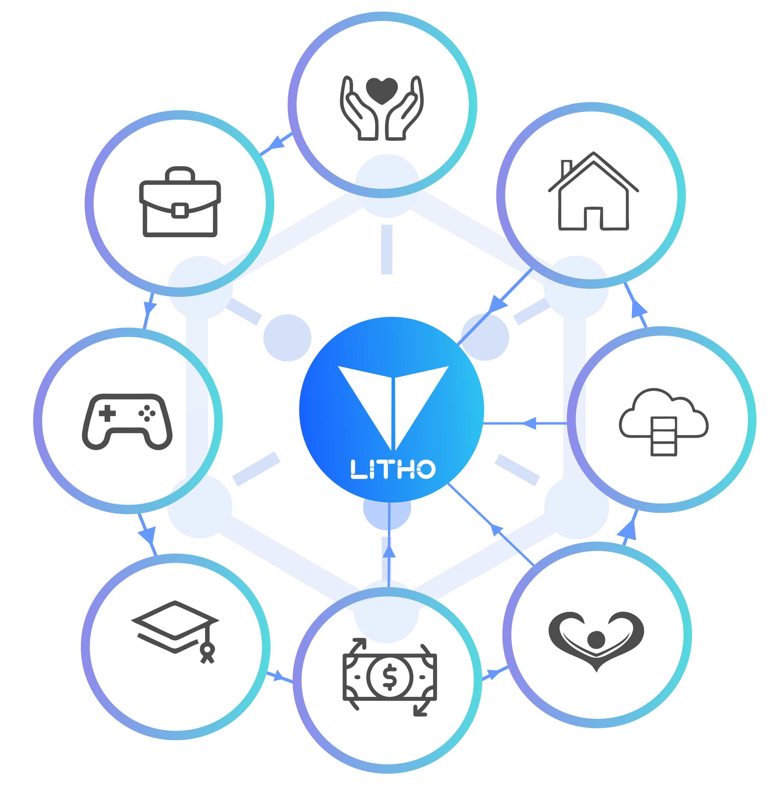

# What is Lithosphere?

Lithosphere is a platform-level public chain for the digital economy era, designed to connect all kinds of values, provide complete financial functions, communicate diverse communities and tokens, and bridge centralized and decentralized organizations to bring the Internet of Value.

## Abstract

In geography, a lithosphere is the rigid, outermost shell of a terrestrial-type planet or natural satellite. On Earth, it is composed of the crust and the portion of the upper mantle that behaves elastically on time scales of thousands of years or greater.

Having closely monitored the blockchain space for the last 10 years, the KaJ Labs Foundation identified an opportunity to build a better blockchain network by learning from the mistakes of early networks. While existing tokens have completed basic functions of value transfer and distribution, they remain far from the fully functional financial services that the real world requires. People need a new generation of financial infrastructure based on blockchain technology that has complete financial functionality, can link different communities and tokens, and can bridge the gap between centralized and decentralized organizations.

## Design Concept

The conventional market economy has significant costs due to a lack of confidence. Centralized organizations face enormous challenges including violent rivalry between groups, concentration of resources, and single points of failure.

Lithosphere's vision is to connect all blockchains and break the barriers between them by allowing cross-chain transactions in a decentralized way. The end goal is to create a connected network of blockchains able to communicate with each other, making it optimal for a variety of use cases instead of being limited to one blockchain network.

With Lithosphere, blockchains can maintain sovereignty, process transactions quickly, and communicate with other blockchains in the ecosystem. A key use case is the transfer of NFTs across chains -- for example, sending Ethereum NFTs to Binance Smart Chain users and vice versa. Lithosphere supports any blockchain that uses Byzantine Fault-Tolerant (BFT) consensus.

## Positioning

Lithosphere aims to create a platform-level public chain in the digital economy era that can:

- **Connect all kinds of values** across different blockchain networks
- **Provide complete financial functions** for the DeFi ecosystem
- **Communicate diverse communities and tokens** through cross-chain interoperability
- **Bridge centralized and decentralized organizations** using blockchain, AI, and other technologies

## Applications

### Borrowing and Lending

Using digital money to produce new value and earn revenue is an unavoidable trend. On Lithosphere, service providers can create deposit applications and set interest rates using smart contracts. Through cross-chain transactions, users can send tokens from any supported blockchain to Lithosphere smart contract addresses.

### Payment and Settlement

Lithosphere is a multi-currency distributed platform that combines many banking ledgers into a single unified ledger. Any business or user may utilize the Lithosphere wallet to make multi-currency payments and settlements without installing multiple digital currency wallets.

### Transaction and Exchange

After currencies are linked with Lithosphere, exchanges and intermediaries may use smart contracts to enable multi-currency auction trading and one-to-one transactions. Lithosphere can handle up to 1,000,000 transactions per second (TPS).

### Investment and Financing

Smart contracts on Lithosphere enable multi-currency ICO/IEO investments. Investors may invest using Ethereum, Bitcoin, or any other blockchain token linked with Lithosphere, and issuers can manage funds more simply.

## Lithosphere Products

1. **Lithosphere Blockchain** (PoS) -- Litho cross-chain native token
2. **LithoSwap** -- Cross-chain DEX with NFT exchange support
3. **LEP100 Token Launchpad** -- Litho Launchpad
4. **Thanos Wallet** -- Multi-currency, cross-chain wallet
5. **JOT NFT Platform** -- NFT marketplace, NFT DEX, SDK for cross-chain NFT distribution
6. **LAX** -- Algorithmic Stablecoin

## Community

- [litho.ai](https://litho.ai/)
- [ecosystem.litho.ai](https://ecosystem.litho.ai)
- [ignite.litho.ai](https://ignite.litho.ai)
- [staking.litho.ai](https://staking.litho.ai)
- [KaJLabs.org](https://kajlabs.org)
- [GoodTokens.org](https://goodtokens.org/)

> **Whitepaper:** The full Lithosphere whitepaper is available as a [downloadable PDF](https://whitepaper.litho.ai).

---

*Disclaimer: This documentation is for information purposes only. The KaJ Labs Foundation does not guarantee the accuracy of or the conclusions reached herein. See the full [whitepaper disclaimer](https://whitepaper.litho.ai) for details.*
