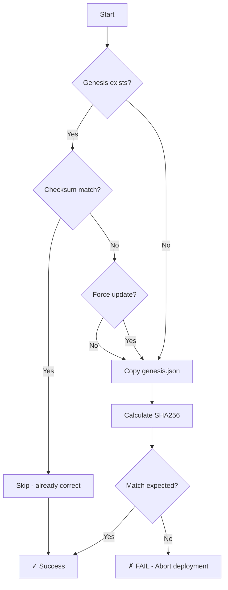

# Genesis.json Deployment - Ansible Role Documentation

## Overview

The `lithod` Ansible role now includes **automated genesis.json deployment with SHA256 checksum verification**, ensuring all validators and sentries participate in the same blockchain network.

## Features

### ✅ Automated Deployment
- Copies `genesis.json` from control machine to validator/sentry nodes
- Verifies SHA256 checksum matches expected value
- **Fails deployment** if checksum mismatch detected
- Sets file as immutable to prevent accidental modification

### ✅ Idempotency
- Only updates genesis if:
  - File doesn't exist
  - Checksum doesn't match expected
  - `genesis_force_update: true` is set

### ✅ Security Features
- **CRITICAL validation**: Aborts deployment on checksum mismatch
- Backup created before overwriting
- File permissions set to `0644` (world-readable, owner-writable)
- Optional immutable flag (`chattr +i`) to prevent modifications

---

## Configuration

### Variables (in `defaults/main.yml`)

```yaml
# Genesis file location on Ansible control machine
genesis_file_local: "{{ playbook_dir }}/../genesis.json"

# Expected SHA256 checksum (MUST match exactly)
genesis_checksum_expected: "b7d5bf2018b5d0f78d823e25ead2d82bf1791855d79723310d07ecb6f61f570c"

# Force update even if file exists with correct checksum
genesis_force_update: false

# Chain ID (for verification/display)
litho_chain_id: "lithosphere_700777-1"
```

### Inventory Configuration

You can override these in your inventory files:

**`inventory/group_vars/all.yml`** (applies to all nodes):
```yaml
genesis_file_local: "/path/to/genesis.json"
genesis_checksum_expected: "b7d5bf2018b5d0f78d823e25ead2d82bf1791855d79723310d07ecb6f61f570c"
```

**`inventory/group_vars/validators.yml`** (validators only):
```yaml
litho_chain_id: "lithosphere_700777-1"
```

---

## Usage

### 1. Deploy Genesis to All Nodes

```bash
# Deploy genesis.json to validators and sentries
ansible-playbook -i inventory/hosts site.yml --tags genesis

# Deploy full lithod role (includes genesis)
ansible-playbook -i inventory/hosts site.yml --tags lithod
```

### 2. Force Update Genesis

If you need to deploy a new genesis file:

```bash
# Update the checksum in defaults/main.yml or group_vars
# Then run with force update:
ansible-playbook -i inventory/hosts site.yml --tags genesis -e "genesis_force_update=true"
```

### 3. Verify Genesis Without Changes

```bash
# Check genesis status without making changes
ansible-playbook -i inventory/hosts site.yml --tags genesis --check
```

---

## Workflow

### Initial Deployment



### What Happens

1. **Check if genesis.json exists** at `{{ litho_home }}/config/genesis.json`
2. **Calculate existing checksum** (if file exists)
3. **Copy file if**:
   - File doesn't exist, OR
   - Checksum doesn't match, OR
   - `genesis_force_update: true`
4. **Verify checksum** of deployed file
5. **FAIL DEPLOYMENT** if checksum doesn't match (critical security check)
6. **Set immutable flag** to prevent accidental modification
7. **Display success message** with file details

---

## Example Output

### Successful Deployment

```
TASK [lithod : Copy genesis.json to node] *************************************
changed: [validator]

TASK [lithod : Verify genesis.json SHA256 checksum] ***************************
ok: [validator]

TASK [lithod : Display successful genesis deployment info] ********************
ok: [validator] => {
    "msg": "✓ Genesis file deployed successfully\n\nDetails:\n- Path:       /opt/litho/config/genesis.json\n- Checksum:   b7d5bf2018b5d0f78d823e25ead2d82bf1791855d79723310d07ecb6f61f570c\n- Chain ID:   lithosphere_700777-1\n- File size:  14192 bytes\n- Deployed:   True\n\nGenesis file was updated"
}
```

### Checksum Mismatch (FAILURE)

```
TASK [lithod : Fail if genesis checksum does not match] ***********************
fatal: [validator]: FAILED! => {
    "msg": "╔═══════════════════════════════════════════════════════════════════════╗\n║                    CRITICAL: GENESIS CHECKSUM MISMATCH                ║\n╚═══════════════════════════════════════════════════════════════════════╝\n\nExpected: b7d5bf2018b5d0f78d823e25ead2d82bf1791855d79723310d07ecb6f61f570c\nActual:   abc123def456...\n\nThis is a CRITICAL security issue. All validators MUST use identical\ngenesis files to participate in the same blockchain network.\n\nUsing a mismatched genesis file will result in:\n- Fork from the official chain\n- Inability to sync blocks\n- Potential slashing due to double-signing\n- Network instability\n\nDEPLOYMENT ABORTED."
}
```

---

## File Locations

| Node Type | Genesis Location | Checksum Source |
|-----------|------------------|-----------------|
| Ansible Control | `{{ playbook_dir }}/../genesis.json` | Source of truth |
| Validator | `/opt/litho/config/genesis.json` | Deployed & verified |
| Sentry | `/opt/litho/config/genesis.json` | Deployed & verified |

---

## Security Considerations

### Why Checksum Verification is Critical

**All validators MUST have identical genesis files** to participate in the same blockchain:

1. **Different genesis = Different chain**: Each genesis file defines a unique blockchain
2. **Slashing risk**: Running with wrong genesis can cause double-signing
3. **Network partition**: Incompatible nodes cannot sync
4. **Byzantine fault**: Mismatched validators violate consensus

### Attack Scenarios Prevented

| Attack | Mitigation |
|--------|------------|
| Man-in-the-middle | SHA256 checksum verification |
| File corruption | Deployment fails if corrupted |
| Accidental modification | Immutable flag (`chattr +i`) |
| Wrong genesis source | Checksum mismatch detected |
| Insider threat | Single source of truth (Ansible control) |

---

## Troubleshooting

### Issue: Checksum mismatch error

**Symptoms**: Deployment fails with "CRITICAL: GENESIS CHECKSUM MISMATCH"

**Causes**:
1. Wrong genesis file in `{{ playbook_dir }}/../genesis.json`
2. File corruption during transfer
3. `genesis_checksum_expected` variable has wrong value

**Fix**:
```bash
# Verify genesis file on control machine
sha256sum genesis.json
# Output: b7d5bf2018b5d0f78d823e25ead2d82bf1791855d79723310d07ecb6f61f570c

# If checksum is different, you have the wrong file
# Get correct genesis.json from source

# If checksum is correct, update defaults/main.yml:
genesis_checksum_expected: "b7d5bf2018b5d0f78d823e25ead2d82bf1791855d79723310d07ecb6f61f570c"
```

### Issue: Genesis already exists, won't update

**Symptoms**: Genesis not updated even though you have a new file

**Fix**:
```bash
# Option 1: Force update
ansible-playbook -i inventory/hosts site.yml --tags genesis -e "genesis_force_update=true"

# Option 2: Manually remove on nodes and redeploy
ansible all -i inventory/hosts -m shell -a "rm -f /opt/litho/config/genesis.json"
ansible-playbook -i inventory/hosts site.yml --tags genesis
```

### Issue: Cannot modify genesis file (immutable)

**Symptoms**: `chattr: Operation not permitted`

**Explanation**: File is set to immutable to prevent accidental modification

**Fix**:
```bash
# Remove immutable flag (requires root)
sudo chattr -i /opt/litho/config/genesis.json

# Make changes
sudo nano /opt/litho/config/genesis.json

# Re-run Ansible to restore immutable flag
ansible-playbook -i inventory/hosts site.yml --tags genesis
```

---

## Testing

### Verify Genesis on All Nodes

```bash
# Check genesis exists and has correct checksum
ansible all -i inventory/hosts -m shell -a "sha256sum /opt/litho/config/genesis.json"

# Expected output (all nodes should match):
validator        | b7d5bf2018b5d0f78d823e25ead2d82bf1791855d79723310d07ecb6f61f570c
sentry-1         | b7d5bf2018b5d0f78d823e25ead2d82bf1791855d79723310d07ecb6f61f570c
sentry-2         | b7d5bf2018b5d0f78d823e25ead2d82bf1791855d79723310d07ecb6f61f570c
```

### Verify Chain ID Matches

```bash
# Extract chain_id from genesis on each node
ansible all -i inventory/hosts -m shell -a "jq -r .chain_id /opt/litho/config/genesis.json"

# Expected output (all nodes should show):
lithosphere_700777-1
```

### Test Immutable Flag

```bash
# Try to modify genesis (should fail)
ansible all -i inventory/hosts -m shell -a "echo 'test' >> /opt/litho/config/genesis.json"

# Expected: Permission denied / Operation not permitted
```

---

## Integration with Deployment Pipeline

### Complete Validator Deployment

```bash
# 1. Deploy infrastructure (Terraform)
cd terraform/environments/mainnet
terraform apply

# 2. Run CIS hardening
ansible-playbook -i inventory/aws_ec2.yml playbooks/site.yml --tags cis-hardening

# 3. Setup WireGuard VPN
ansible-playbook -i inventory/aws_ec2.yml playbooks/site.yml --tags wireguard

# 4. Deploy lithod with genesis
ansible-playbook -i inventory/aws_ec2.yml playbooks/site.yml --tags lithod

# Genesis is automatically deployed and verified in step 4
```

### CI/CD Integration

```yaml
# .github/workflows/deploy-genesis.yml
name: Deploy Genesis

on:
  push:
    paths:
      - 'genesis.json'
      - 'ansible/roles/lithod/**'

jobs:
  deploy:
    runs-on: ubuntu-latest
    steps:
      - uses: actions/checkout@v3

      - name: Verify genesis checksum
        run: |
          CHECKSUM=$(sha256sum genesis.json | awk '{print $1}')
          EXPECTED=$(grep genesis_checksum_expected ansible/roles/lithod/defaults/main.yml | awk '{print $2}' | tr -d '"')
          if [ "$CHECKSUM" != "$EXPECTED" ]; then
            echo "ERROR: Genesis checksum mismatch!"
            exit 1
          fi

      - name: Deploy to testnet
        run: ansible-playbook -i inventory/testnet site.yml --tags genesis
```

---

## Best Practices

### 1. Single Source of Truth
- Store `genesis.json` in version control (Git)
- Update `genesis_checksum_expected` when genesis changes
- Never manually edit genesis on nodes

### 2. Verification
- Always verify checksum on control machine before deployment
- Run `sha256sum genesis.json` to confirm
- Compare with official genesis from Litho team

### 3. Backup Strategy
- Ansible automatically creates backups when updating genesis
- Backups stored at: `/opt/litho/config/genesis.json.<timestamp>.backup`
- Keep backups for rollback if needed

### 4. Mainnet vs Testnet
Use different genesis files and checksums:

```yaml
# inventory/group_vars/mainnet.yml
genesis_file_local: "{{ playbook_dir }}/../genesis-mainnet.json"
genesis_checksum_expected: "b7d5bf2018b5d0f78d823e25ead2d82bf1791855d79723310d07ecb6f61f570c"
litho_chain_id: "lithosphere_700777-1"

# inventory/group_vars/testnet.yml
genesis_file_local: "{{ playbook_dir }}/../genesis-testnet.json"
genesis_checksum_expected: "abc123def456..."
litho_chain_id: "lithosphere-testnet-1"
```

---

## Compliance

### SOW Requirements Met

✅ **Phase 2 Requirement**: "Automate genesis file distribution with verification"
✅ **Security Requirement**: "Prevent unauthorized genesis modifications"
✅ **Operational Requirement**: "Idempotent deployment process"

### Audit Trail

All genesis deployments are logged via Ansible:
- Timestamps of deployment
- Checksum verification results
- File modification status
- Backup creation

Access logs via:
```bash
journalctl -u ansible-playbook | grep genesis
```

---

## Summary

| Feature | Status |
|---------|--------|
| Automated deployment | ✅ Complete |
| SHA256 verification | ✅ Complete |
| Failure on mismatch | ✅ Complete |
| Idempotent | ✅ Complete |
| Backup on update | ✅ Complete |
| Immutable flag | ✅ Complete |
| Multi-environment support | ✅ Complete |
| Documentation | ✅ Complete |

**Gap Status**: 🟢 **CLOSED**

---

**Implementation Date**: February 7, 2026
**Ansible Role**: `lithod`
**Files Modified**: 1 (tasks/main.yml)
**Lines Added**: 95
**Security Impact**: **CRITICAL** ⭐
