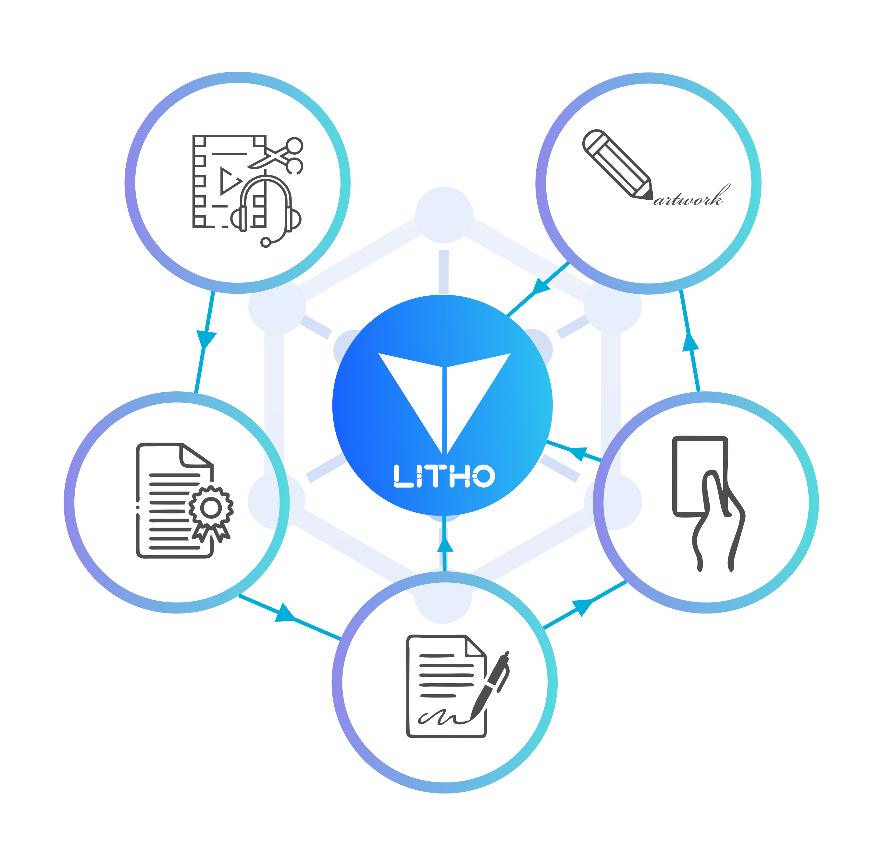

# Lithosphere Architecture and Technology

#### **Distributed Private Key Management and Smart Contract Virtual Machine**

Because DeFi assets are displayed as tokens, they can substantially improve the interoperability of the Internet of Value and make increasing scalability much easier if multi-token smart contracts can be implemented. The present cross-chain technology is mostly side-chain technology, which uses a two-way peg to transfer transactions to side chains and multiple signatures to exit side chains. Such a method can only produce atomic transfers, and the results are unsatisfactory in nearly every way. We need to create a public chain that allows other tokens to be mapped to it in a more inventive fashion, so that multi-token smart contracts may be created.&#x20;

We can substantially improve the interoperability of the Internet of Value in this manner, and this public chain will undoubtedly become one of the most important DeFi infrastructures. It not only communicates value between blockchains but also enables interfaces with centralized organizations and off-chain data sources to increase the Internet of Value scalability. On a new public chain, how will various tokens be expressed? We envisage that the tokens’ private keys on various blockchains can be securely controlled in a distributed fashion by a public chain and in this way, the blockchain manages the control rights of tokens. It will be like a “freeway” on the Internet of Value, which can easily implement the value transfers between various tokens and multi-token smart contracts to provide various DeFi services.

Since almost all blockchain tokens are controlled by private keys, value on the Internet of Value can be distributedly managed by smart contracts as long as the private keys of their tokens can be controlled by distributed nodes of a public chain. With Turing-complete smart contracts, the public chain can also provide various functions of decentralized finance (DeFi) in a more sophisticated form.\
This blockchain, which connects all tokens, does not require complex logic for various application scenarios. Its purpose is to create a layer of management across all blockchains, enabling all tokens to interact. Because it does not need to run heavy application logic, in its current usability it is capable of fulfilling various DeFi functions.
