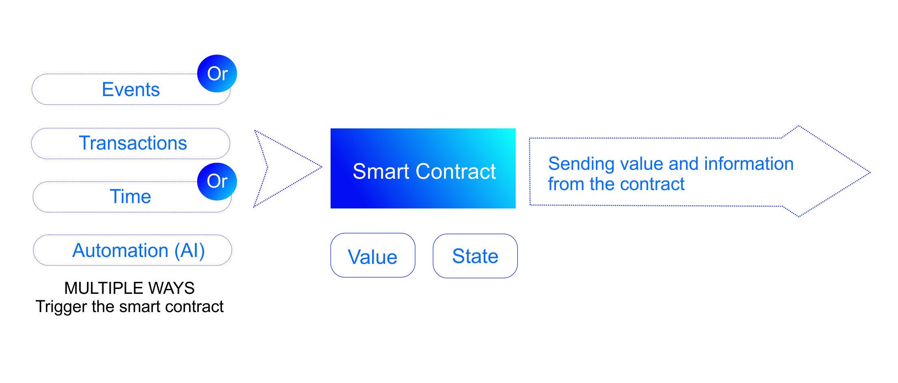

# Contract multi-triggering mechanism Diversity of triggering conditions

Because the present smart contract is triggered by a transfer to the contract, the current implementation of smart contracts is based on the transfer of ownership of digital assets.

When a user starts a transfer to a smart contract, for example, a node must first validate the legality of the transfer, which includes determining if the user’s current financial balance on the blockchain supports the transaction. The smart contract then runs the relevant function for accepting the gift and judges it based on the function’s predetermined response condition. For example, the smart contract will examine the entire amount of the donation and only accept it if it does not over the quota. Finally, a modified contract value or smart contract state will be placed into the block to indicate that the transaction has taken place.

We can see from the preceding analysis that the smart contract’s functions will involve judgments on some criteria, but these conditions will not be checked if the smart contract is not triggered in the first place. The execution of the following rules in the smart contract will not be triggered even if the required circumstances are satisfied. Many financial transactions scenarios, such as a passive quantitative trading strategy, are impossible to execute if a smart contract cannot be triggered by factors other than a transaction. As a result, improving the triggering mechanism is the first step towards improving smart contracts for DeFi applications. Aside from supporting the existing active triggering method, two new triggering mechanisms are introduced: time triggering and event triggering. The extended triggering mechanism is also known as the multi-triggering mechanism.

**The three trigger modes of the multiple triggering mechanisms are as follows:**\

* The active triggering mode is similar to the current smart contract triggering mode and is compatible with all smart contracts.
* Timing triggering mode refers to the ability of a smart contract to be activated by time circumstances such as a time point or duration.
* Event triggering mode indicates that a smart contract will be activated when a certain event happens, such as usual swaps over time, and such applications will be fully supported by time triggering mode. Capturing events is critical in automated trading and quantitative trading, for example. The events triggering mode must be used to initiate such occurrences.

At the moment, smart contracts can only handle information from within their blockchain, however, in the event of multiple triggering mechanisms, some of the triggering information will come from outside. As a result, smart contracts will provide an external information input interface and use different techniques to verify the validity and authenticity of off-chain data.

To do so, Lithosphere will first transmit outside data through HTTP or socks to the nodes, depending on common APIs offered by third-party data sources. Lithosphere will encapsulate data calls from certain widely used off-chain data sources, which will function similarly to a system call to supply data for node acquisition. Nodes can, however, create their datasources using the aforementioned data collection routes to get important data information.

The consensus process verifies the validity of the off-chain data acquired. When a node discovers that off-chain data is linked to specific smart contract triggering circumstances, the node will run and broadcast the smart contract. If a malicious node purposefully broadcasts a smart contract over the whole network, the network may simply terminate the smart contract during the execution phase if it is judged malicious, because the smart contract will be re-verified by other honest nodes before execution. Such malevolent conduct will have no impact on the smart contract’s real operation, and there will be no opportunity to profit from unearned or arbitrage profits.

Incentive methods can also help with the issue of off-chain data entry effectiveness. Because data confirmation requires network consensus, nodes can only increase their revenue by pursuing quicker and more trustworthy data sources and accurately validating triggering circumstances. The high- efficiency network nodes would be rewarded due to the nature of the efficient market and resource allocation. The validity of the final data is unaffected by data generated by a few rogue nodes.

####
