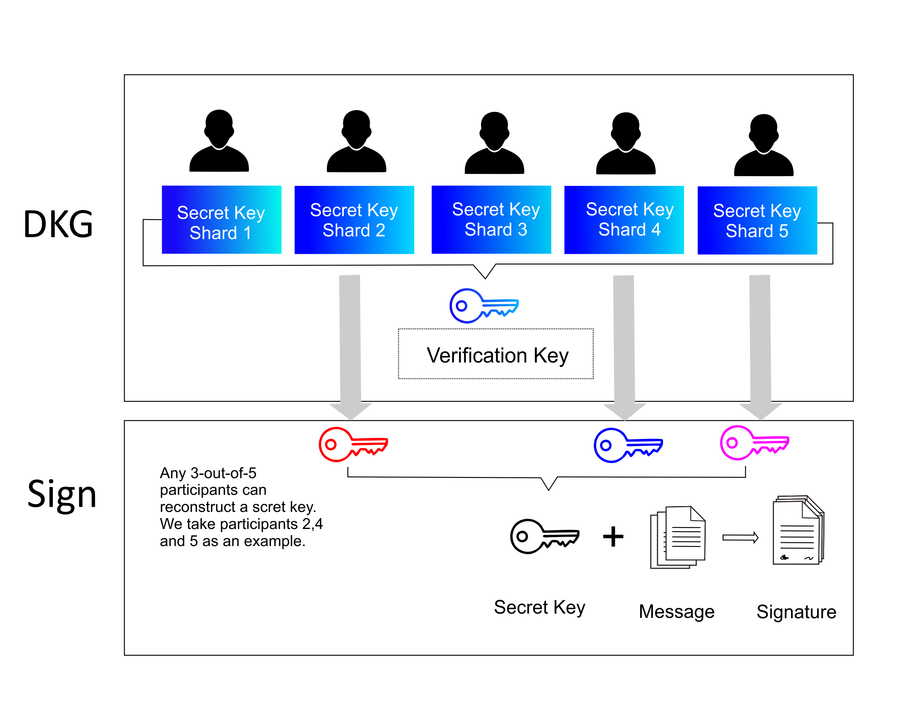

# Myriad Distributed Key Management (MDKM)

Lithosphere is based on the theories and achievements of distributed key generation (DKG) in the field of cipher- sharing. The public key and the private key are both generated by nodes cooperating to communicate. The public key is broadcast in the public chain, the private key is separately stored by each node in a distributed manner through Variable Secret Sharing (VSS). The common public key is generated by the DKG algorithm, and then the account address of the Lock-in is generated by the corresponding algorithm to realize decentralized control. Here we refer to the domain of VSS and DKG based on elliptic curve cryptography distributed key generation protocol and application research on the process described below: Given elliptic curve E, there exists a finite field GF (q), q is a prime number with n participant sets Q = {P1, P2, …, Pn}, pi denotes the identity of the ith participant Pi, and Pi ∈ GF ∗ (q), where GF ∗ (q) is a multiplicative group on GF (q). In the meantime, pi and I are interchangeable during the calculation. E/GF (q) represents the additive group on E. T is E/GF (q), the order of E/GF (q) is a prime number or prime factor, marking this prime or prime factor as p. In this key generation protocol, it is assumed that both scalar multiplication and dot multiplications are done at δ and that the other operations are done at GF (q). To calculate Q (x) T, we first compute Q (x) and then p(x) mod p, and Q (x) mod p is the scalar multiplication on T. Let us assume that E has another base point T ′ on the elliptic curve δ.
