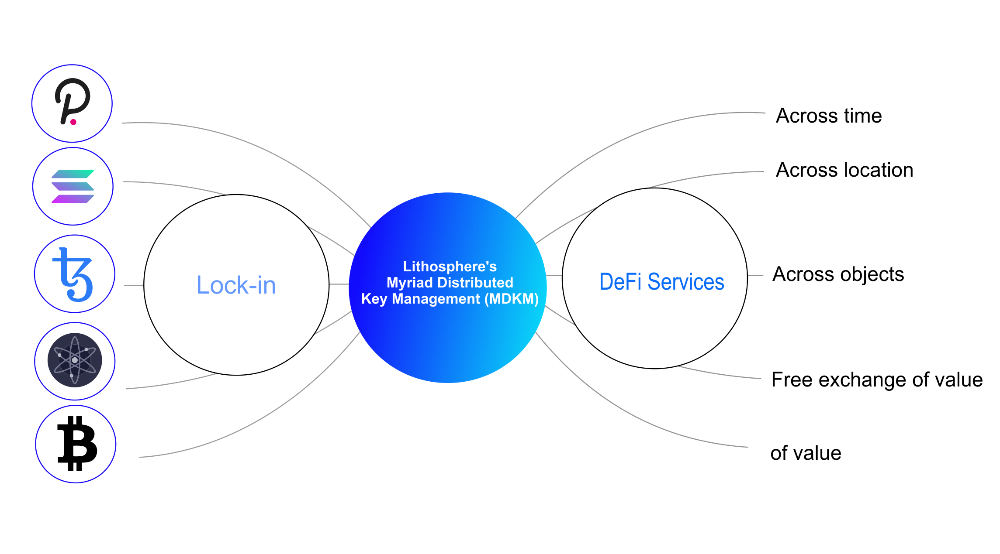

# Myriad Distributed Key Management

Myriad Distributed Key Management realizes the generation of public-private key pairs and addresses and the transaction signatures on the target blockchain in a distributed manner through several nodes and according to digital signature algorithms adopted by the target blockchain, thus realizing the control and management of accounts and assets on the target blockchain in a distributed manner.

Such a technical route enables MDKM to be compatible with as many digital assets controlled by encryption algorithms as possible, whether these digital assets are generated on a centralized or decentralized basis. By supporting a signature algorithm with MDKM, a series of encrypted digital assets with the same signature algorithm can be controlled and managed.

At present, most (over 80%) of encrypted digital currencies adopt the same ECDSA signature algorithm as Bitcoin and Ethereum, so MDKM first chooses to implement support for the ECDSA signature algorithm. In addition, MDKM will support encryption currencies that use different signature algorithms, such as Stellar’s Ed25519 signature algorithm \[JL17], and Schnorr’s signature algorithm.
