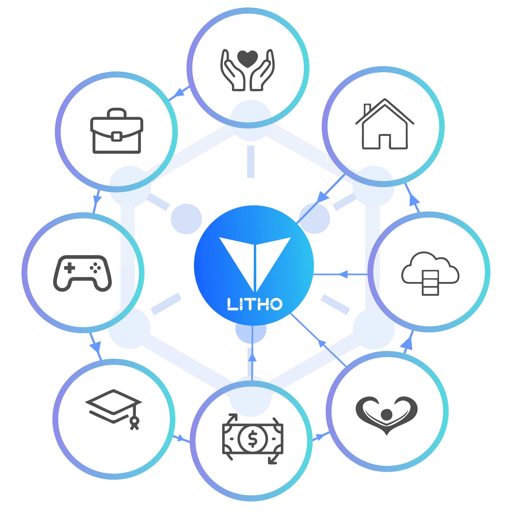

# Smart Contracts & Decentralized Finance (DeFi)

The goal of the Internet of Value is to link different values to blockchains so that smart contracts may control them. The Internet of Value enables decentralized, disintermediated, inclusive, and programmable collaboration among individuals. Because of these apparent benefits, diverse values will race to be mapped to blockchains. The Internet of Value will undoubtedly expand at a faster rate as blockchain constraints are addressed. The process of mapping values to blockchains necessitates decoupling financial logic from business logic, implying that the Internet of Value was created with a significant financial component.&#x20;

The financial applications of the Internet of Value are those applications on the Internet of Value that have particularly significant financial features. Decentralized Finance refers to the on-chain financial operations on the Internet of Value, as well as their corresponding off- chain financial activities (DeFi). Because the Internet of Value is built on peer-to-peer networks that use the User Datagram Protocol, there are certain obstacles. The performance of the Internet of Value will progressively approach that of the Internet of Information in the future, allowing business scenarios and financial transactions to be written in the same software.&#x20;

However, given the current state of affairs, we expect this will take a long time. The present Internet of value will primarily support financial applications, i.e., DeFi apps will be the primary applications. The Internet of Information has already had a significant influence on r lives. We may also anticipate significant changes in our lives as a result of the Internet of value. We may be familiar with the many forms of information available on the internet, but few people talk about the “value” of the Internet of value. To begin with, the values on the Internet of value are tokens represented by the blockchain, and the process of mapping values to the Internet of value is known as asset tokenization.

The connected assets will be expressed by on-chain tokens and form part of the Internet of value if the tokens on the chains represent the title, gain, and control of the underlying off-chain assets. The Internet of value allows more and more values to enter itself through this process, preventing “double spending” through distributed books and making transferring value without intermediaries as simple as sending information and programming values as simple as programming information, making the Internet of value’ prospects similar to what we have seen previously regarding telecommunications. Second, tokenization is a form of asset securitization in which off-chain values are mapped onto chains as crypto assets. Because tokens may be divided indefinitely and transferred over time and space, they can be used in financial transactions like mortgages, loans, and insurance.

As a result, tokenization is defined as the process of securitizing assets and converting off-chain assets into crypto assets that can be managed using private keys. Finally, the Internet of value will include a wider range of values. Identities, signatures, data, voting rights, and other data will be mapped to the Internet of value as long as tokenization is profitable. As a result, the Internet of value will have a wider range of values than traditional financial markets.
